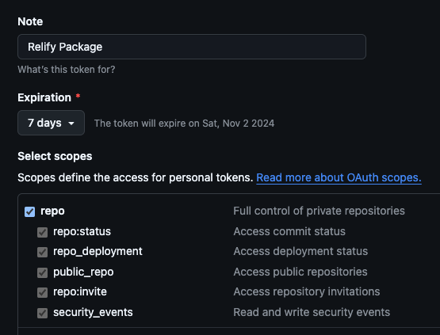

# Relify - Simple Releases

> **Relify** is a lightweight CLI tool for managing and deploying releases with ease. Built for simplicity, Relify helps you automate your release process with a friendly, interactive interface and visual feedback.

## Features

- **Simple Release Management**: Initiates releases by fetching commit history and preparing your repository for deployment.
- **Interactive Console**: Enjoy visual loading effects and a welcoming robot assistant.
- **Secure**: Relify does not store or save any API keys from inputs.

## Requirements

- **Node.js**: Ensure you have [Node.js](https://nodejs.org/) installed (version 16 or higher).

## Usage

Relify works directly from the command line with `npx`. No additional setup is needed.

```bash
npx relify
```

## Important Notes
- **Data Privacy**: Relify does not store or retain any API keys from inputs. API keys are used only within the session.
- **Current Platform**: Relify currently supports GitHub for managing releases. Additional platform support may come in future updates.

## Retrieving Github Personal Access Token
1. Go to https://github.com/settings/tokens/new
2. Enter a note for the token like "Relify Package" and select the `repo` scope.
3. Copy the generated token and use it in the Relify CLI, when asked for it.



## License

MIT License